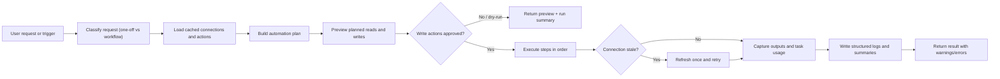

# Architecture

This repo is intentionally split into two layers:

- **General-purpose automation skill**: connection discovery, action discovery, previews, confirmation, execution, logging, and task tracking
- **Flagship workflow examples**: concrete end-to-end workflows that demonstrate how the pattern adapts to a real process

## Public Interfaces

- `AutomationRequest`: trigger context, dry-run mode, approvals, and cycle usage
- `AutomationPlan`: previewable description of the automation and its planned steps
- `AutomationStep`: app/action-level unit of work with confirmation and dedupe metadata
- `AutomationResult`: structured execution result with warnings, errors, and projected task usage

## Why this shape

- It keeps the skill broad enough for any Zapier-powered process
- It makes previews and confirmation first-class for safer automations
- It makes examples reusable instead of hard-coding business logic into one script
